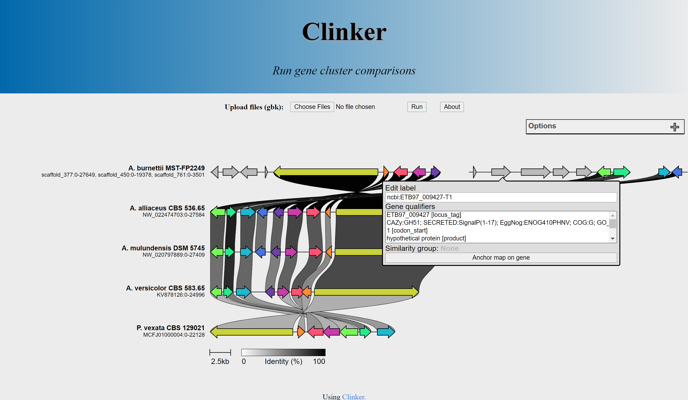

# Using Clinker in a server

Semidán Robaina Estévez (srobaina@ull.edu.es)

[Clinker](https://github.com/gamcil/clinker) is a great tool to visualize sequence alignments. It generates an interactive figure in a HTML page, which is loaded locally. In some settings, it is useful to be able to access Clinker directly from a server, so t he user doesn't have to install Clinker locally. One such setting is a classroom, where multiple students need to use Clinker to visualize an alignment. It would be easier to just run Clinker on a server and connect via an url.

I started this project to solve the previous issue. This project adds some PHP and JavaScript code to be able to access Clinker via remote server. I have found this solution very useful, and perhaps other people will! This project is in an early stage. Contributions are welcome.

To use it, just git clone the repo into the root directory of your web server. Then add the path to the clinker executable in your server to the global variable "clinker_path".

Here are the additions with respect to the "local" clinker:

1. Operates via web application, gbk files are uploaded
2. Tools sidebar slightly modified to fit in screen as well as to remove redundant options
3. Gene info displayed on hover. I found this addition useful for teaching purposes.

And here is an example of how it looks like (sorry, currently don't have access to a server so I cannot provide a working example):

Cheers,

Semidán

# TODO

1. Make it into an installable package of some sort, possibly node?
2. Some code refactoring is always possible
3. Front-end can be improved
